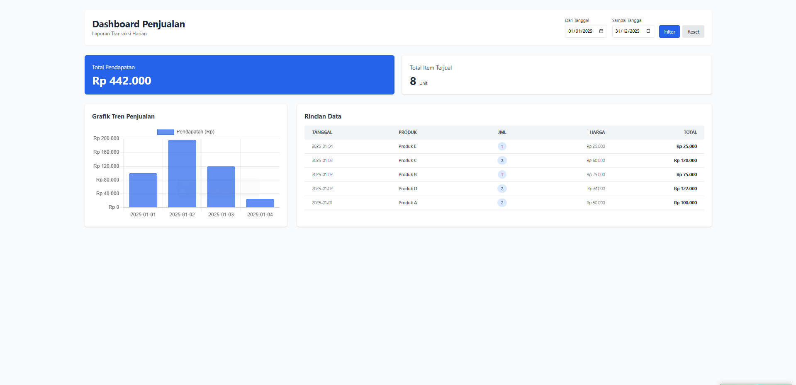

# 📊 Dashboard Penjualan — README

## ✨ Fitur Utama

🔗 Live Demo

https://dashboard-penjualan.onrender.com

## 📸 Screenshot



* **Dashboard Overview:** Menampilkan total pendapatan dan total item terjual.
* **Grafik Tren Penjualan:** Visualisasi pendapatan harian menggunakan Chart.js.
* **Tabel Data Rinci:** Daftar transaksi lengkap dengan harga satuan dan total.
* **Filter Tanggal:** Menyaring data berdasarkan rentang tanggal tertentu.

---

## 🧰 Teknologi yang Digunakan

* **Framework:** Laravel 10
* **Database:** SQLite (default) / MySQL (opsional)
* **Frontend:** Blade Template, Tailwind CSS (CDN)
* **Charting:** Chart.js
* **Deployment (opsional):** Docker (untuk Render)

---

## 💻 Instalasi Lokal

Ikuti langkah-langkah berikut untuk menjalankan proyek ini di komputer Anda:

### **Prasyarat**

* PHP >= 8.1
* Composer
* Git

### **1. Clone Repository**

```bash
git clone https://github.com/username/nama-repo.git
cd nama-repo
```

### **2. Install Dependencies**

```bash
composer install
```

### **3. Setup Environment**

```bash
cp .env.example .env
```

### **4. Generate Key & Migrasi Database**

```bash
php artisan key:generate
php artisan migrate
```

### **5. Import Data Dummy (Seeding)**

Langkah ini memasukkan data awal (Produk A–Produk E).

```bash
php artisan db:seed --class=PenjualanSeeder
```

### **6. Jalankan Server**

```bash
php artisan serve
```

Akses aplikasi melalui: **[http://localhost:8000](http://localhost:8000)**

---

## 📘 Panduan Penggunaan

### **Filter Tanggal (Wajib Menggunakan Data Dummy)**

Agar grafik penjualan muncul, pastikan Anda menggunakan rentang tanggal sesuai data dummy.

**Contoh:** Isi tanggal antara **01/01/2025 s/d 31/01/2025**, lalu klik tombol **Filter**.

---

## ☁️ Deployment Menggunakan Render.com (Free Tier)

Proyek ini menggunakan Docker sehingga dapat di-deploy di Render Free Tier.

### **Langkah 1: Persiapan File**

Pastikan file berikut **sudah ada** di root project:

* `Dockerfile`
* `docker-compose.yml` *(opsional)*
* Menggunakan PHP 8.2 dan SQLite

### **Langkah 2: Setup di Render**

1. Buka **dashboard.render.com**
2. Klik **New → Web Service**
3. Pilih **Build and deploy from a Git repository**
4. Sambungkan repository GitHub Anda

### **Langkah 3: Konfigurasi Web Service**

* **Name:** dashboard-penjualan
* **Region:** Singapore (SG)
* **Runtime:** Docker
* **Instance Type:** Free

### **Environment Variables (Wajib)**

| Key           | Value               |
| ------------- | ------------------- |
| APP_KEY       | (salin dari `.env`) |
| APP_DEBUG     | true                |
| DB_CONNECTION | sqlite              |

### **Langkah 4: Deploy**

Klik **Create Web Service**. Render akan otomatis:

* build image Docker
* migrate database
* menjalankan aplikasi

---

## 📷 Struktur Folder Penting

```
public/
 └── img/
      └── image.png   ← gambar disimpan di sini
resources/
 └── views/
      └── ...
```

---

## ✔️ Selesai
